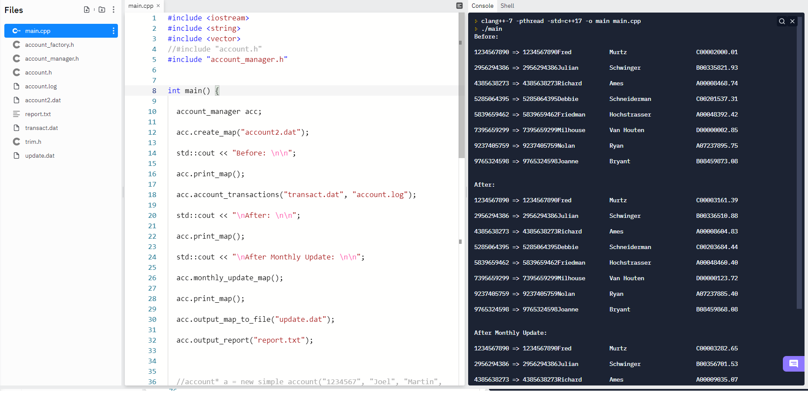
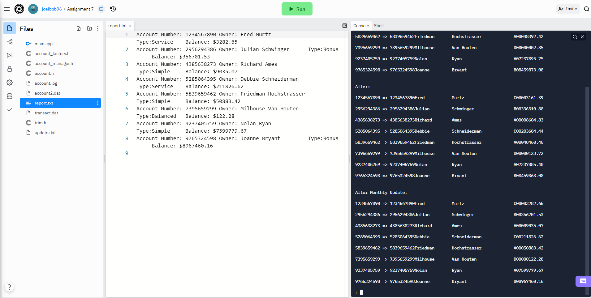

# Cpp-7-Accounts-and-Transactions

## Creates account objects from file input, and conducts transactions on those files based on file input.

#### Abstract
This program utilizes inheritance to construct several types of *account* objects from one base *account* object. The program takes input from a file called **account2.dat** and uses that input to construct several accounts, of differing types. The account type constructed is determined by a character from A-D or X at character position 50 on each line of input. The only main difference between each *account* type is how much interest will be applied to the *account* during each *monthly_update*. After every *account* has been constructed and stored in a Map, transactions are executed on them. Transactions are input from the **transact.dat** file and are applied to each *account* in the map. After transactions are complete, and *monthly_update* is applied to each *account*. The information about each *account* in printed to the screen after each change has been applied. The final *account* data is then printed to the **update.dat** file. 

#### Base *account* object
```
class account{
  protected:
  std::string account_code;
  std::string first_name;
  std::string last_name;
  double balance;
  std::string type;
```

#### Description
The program starts by constructing an *account manager* object. This object contains the main *account* map, and several functions to construct accounts to store in the map. The *create_map* function is called which takes a file name as input and constructs the map of files based on the input from that file. This function call uses the **account2.dat** file for file input. Each line of input from the file constructs a new *account* for the map. The type of *account* constructed depends on the character at position 50 of each line of input. The character at this position can be A, B, C, or D. Any other letter in this position(including X which shows a closed account) will cause no *account* to be constructed from that line. The newly constructed map of *accounts* is then printed to the screen.

The "account_transactions" is then called to conduct transactions on the *accounts* in the map. The transactions are each read in from the **transact.dat**. Each line of input from the file contains the *account_code* of the account the transaction is for, and the amount that the transaction is. Each transaction is read in and applied to each account. If an error occurs while conducting transactions, that error is output to the **account.log** file. The results of the *accounts* after the transactions have been applied are then printed to the console.

The *monthly_update_map* function is then called, which calls the *monthly_update* function from each account in the map. This function applies a monthly interest rate to each account, which differs based on the account type. As an example, a *simple account*(character code A) will gain 5% of the balance in the *account*. A *bonus account* (character code B) will gain 6% if the *account* balance is over 5000, or 4% if the balance is less. The *account* information after the *monthly_update* has been applied is then printed to the console, and to the file **update.dat**.

The *output_report* function is then called which generates a file called **report.txt**. This report contains more detailed information about the *accounts* in the map, after the changed were applied to them. 

#### Screenshots showing the results of the program running.



